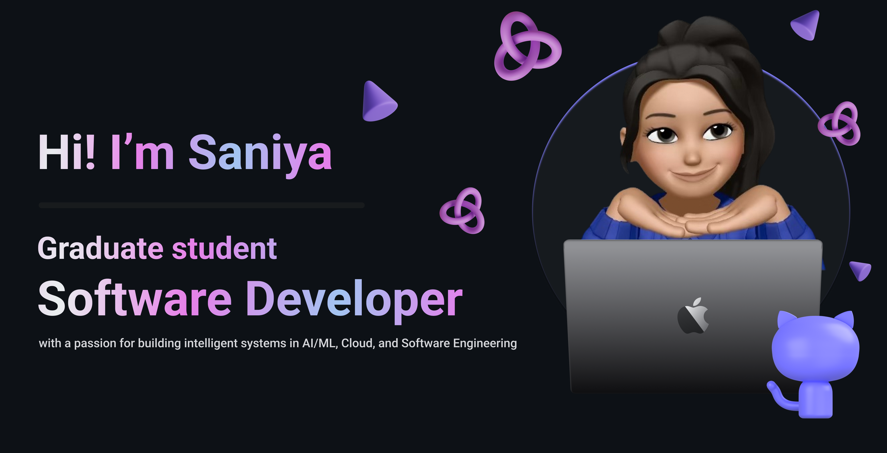

## Hi! I'm Saniya
**MS CS Student @ UC San Diego | Software Engineer | AI/ML Enthusiast | Full Stack Developer**

### 🌟 About Me 

I'm a Full Stack Developer and **MS CS student at UC San Diego** with professional experience in **backend fintech systems** and hands-on projects across **AI/ML, reinforcement learning, and anomaly detection**. I’ve delivered systems and research prototypes that focus on **scalability, data-driven design, and intelligent automation**.  

- 💻 **Software Developer Intern @ Be The Bank** – Built secure APIs with NestJS & PostgreSQL, enabling daily transactions at 99.79% uptime.
- 📈 Developed **self-supervised Transformer models** for stock price anomaly detection, uncovering 300+ hidden patterns and reducing manual review time.
- 🚦 Implemented **reinforcement learning agents in SUMO** for adaptive traffic control, cutting vehicle wait times by 30% and boosting flow efficiency by 20%.
- ⌚ Engineered a multi-sensor anomaly detection system on wearable data with Transformers, achieving near-perfect accuracy.
- ☁️ Hands-on with **AWS, Docker, GCP, REST APIs, and CI/CD** pipelines for scalable deployments.
- 🔬 Currently exploring **MLOps and generative AI** to bridge research with production-ready systems.
- 🚀 Actively seeking Software Engineering and AI/ML opportunities starting 2026.
- 📫 Reach me at **sapatil@ucsd.edu** | [LinkedIn](https://linkedin.com/in/saniyapatil2345)  

---

### 🛠 Tech Stack  

**Programming**  

  

**Web Development**  

  

**Databases**  

  

**Tools & Cloud**  

  

**ML / AI**  

---

### 📚 Relevant Coursework
- Statistical NLP  
- AI Agents
- Generative AI
- Machine Learning  
- Algorithm Design and Analysis
- Seminar in Databases
- Big Data Science & Knowledge
  
---

### 🎯 Fun Facts
- 🌱 Currently exploring **Generative AI & Agents**  
- ☕ Runs on caffeine + code  
- ✈️ Loves traveling & meeting new people

---

