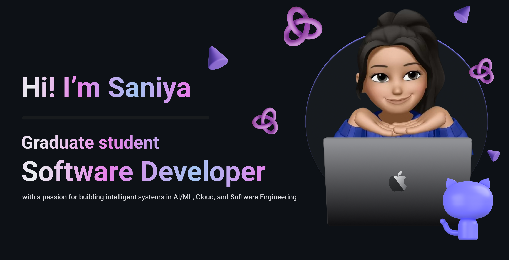

## Hi! I'm Saniya
**MS CS Student @ UC San Diego | Backend & Distributed Systems Engineer | Building Scalable, Fault-Tolerant Systems**

### 🌟 About Me 

I'm a **Backend and Distributed Systems Engineer** and MS CS student at UC San Diego with experience building large-scale distributed systems, real-time data pipelines, and backend infrastructure. I focus on **scalability, fault tolerance, and high-performance system design**.

- 🔧 **Built a distributed video storage & streaming platform** using Go and gRPC with consistent hashing across 5+ storage nodes
- 📊 **Engineered a real-time trade analytics pipeline** using Kafka, Spark Structured Streaming, and Delta Lake — sustaining 5,000+ events/sec
- 🎵 **Developed a full-stack music retrieval platform** with a Go backend achieving sub-100ms query latency across 1,000+ tracks
- 💳 **Software Developer Intern @ Be The Bank** — Built a distributed payment processing system handling 10K+ daily transactions at 99.9% uptime
- ☁️ Hands-on with **Go, Python, AWS, Docker, gRPC, Kafka, PostgreSQL, and CI/CD**
- 🔬 Currently exploring **distributed systems design and backend infrastructure at scale**
- 🚀 Actively seeking **Software Engineering opportunities starting 2026**
- 📫 Reach me at **sapatil@ucsd.edu** | [LinkedIn](https://linkedin.com/in/saniyapatil2345)

---

### 🛠 Tech Stack  

**Programming**  

  

**Web Development**  

  

**Databases**  

  

**Tools & Cloud**  

  

**ML / AI**  

---

### 📚 Relevant Coursework
- Statistical NLP  
- AI Agents
- Generative AI
- Machine Learning  
- Algorithm Design and Analysis
- Seminar in Databases
- Big Data Science & Knowledge
  
---

### 🎯 Fun Facts
- 🌱 Currently exploring **Generative AI & Agents**  
- ☕ Runs on caffeine + code  
- ✈️ Loves traveling & meeting new people

---

